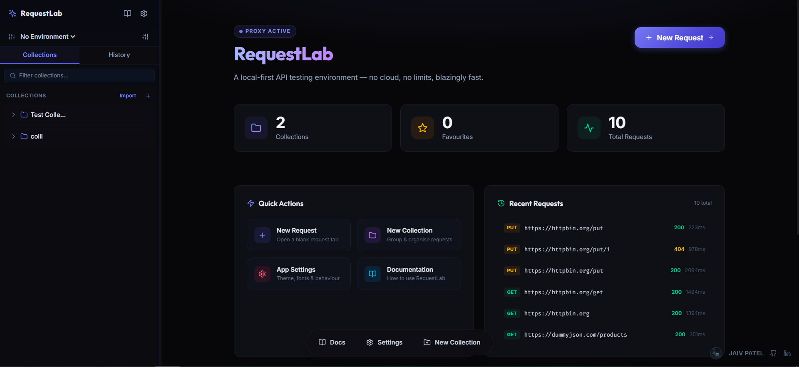
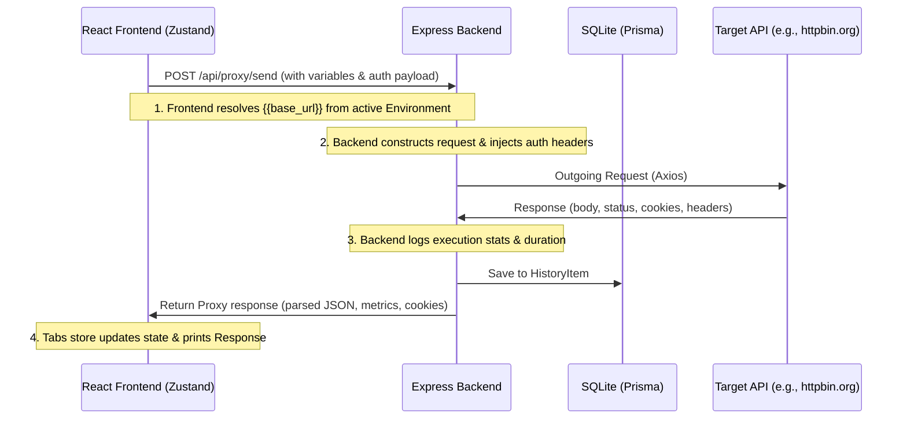

# RequestLab

A local-first, open-source API client built for speed, privacy, and a modern developer experience. RequestLab runs entirely on your machine, ensuring that all your requests, collections, and environment data never leave your computer.

![RequestLab Screenshot]

## Features

RequestLab is a fully functional, developer-focused API client with a modern glassmorphic look that runs completely locally.

*   **Fully Local & Private**: All data (requests, collections, history) is stored in a local SQLite database. No cloud sync, no accounts, no tracking.
*   **CORS-Bypass Proxy**: A built-in Express.js proxy forwards requests from the backend to bypass browser CORS limitations completely.
*   **Collections & Folders**: Organize your API requests with nested folders, drag-and-drop reordering, and favoriting.
*   **Environments & Variables**: Manage variables like base URLs and tokens across different environments (e.g., `Production`, `Staging`) using `{{variable}}` syntax.
*   **Rich Request Editor**:
    *   Support for all major HTTP methods (GET, POST, PUT, PATCH, DELETE, etc.).
    *   Visual editors for query parameters, headers, and cookies.
    *   Multiple auth schemes: Bearer Token, Basic Auth, and API Key.
    *   Monaco Editor for request bodies with support for JSON, XML, and Raw text.
*   **Detailed Response Viewer**:
    *   View status codes, response time, and size.
    *   Pretty-printed and raw JSON/XML/HTML views.
    *   Sandboxed `iframe` for safe HTML response previews.
    *   Inspect response headers and cookies.
*   **Code Snippet Generator**: Instantly generate client code for `cURL`, `JavaScript Fetch`, `Axios`, and `Python Requests`.
*   **Request History**: Automatically logs every request for easy re-running and debugging.
*   **Global Settings**: Customize the theme (Light/Dark), editor font size, and toggle autosaving.
*   **Command Palette**: Press `Ctrl+Shift+P` to quickly switch themes, create tabs, or jump to saved requests.

## Tech Stack

*   **Frontend**: React, TypeScript, Vite, Zustand, Monaco Editor, TailwindCSS
*   **Backend**: Node.js, Express, TypeScript
*   **Database**: SQLite with Prisma ORM

## Getting Started

Follow these steps to get RequestLab running on your local machine.

1.  **Clone the repository:**
    ```bash
    git clone https://github.com/your-username/RequestLab.git
    cd RequestLab
    ```

2.  **Install dependencies:**
    This will install dependencies for both the frontend and backend services.
    ```bash
    npm install
    ```

3.  **Run the development server:**
    This command starts both the React frontend and the Express backend concurrently.
    ```bash
    npm run dev
    ```

4.  **Open the app:**
    Navigate to `http://localhost:5173` (or the port specified by Vite) in your browser. The backend proxy will be running on `http://localhost:5050`.

## Quick Start

Get your first API request sent in under 60 seconds.

1.  **Open a new request tab** by clicking the "New Request" button or pressing `Ctrl + T`.
2.  **Enter a URL**. Try a public test API like `https://httpbin.org/get`.
3.  **Click Send** or press `Ctrl + Enter`.
4.  **Inspect the response** in the panel that appears, where you can view the body, headers, and performance metrics.

## How It Works

RequestLab's architecture is designed for local-first operation and to overcome common API development hurdles.



1.  **CORS Bypass (Proxying)**: To avoid browser Same-Origin Policy restrictions, the React frontend sends all API calls to its own local Express server. This server acts as a proxy, makes the actual HTTP request to the target API, and pipes the response back to the client.
2.  **Variable Interpolation**: The client scans the active environment for placeholders like `{{token}}` and replaces them with their corresponding values before sending the request to the proxy.
3.  **Local Persistence**: All collections, environments, and history are stored in a local SQLite database file, managed by the Prisma ORM.

## Contributing

Contributions are welcome! If you have a feature request, bug report, or want to contribute to the code, please feel free to open an issue or submit a pull request.

1.  Fork the repository.
2.  Create your feature branch (`git checkout -b feature/AmazingFeature`).
3.  Commit your changes (`git commit -m 'Add some AmazingFeature'`).
4.  Push to the branch (`git push origin feature/AmazingFeature`).
5.  Open a Pull Request.
