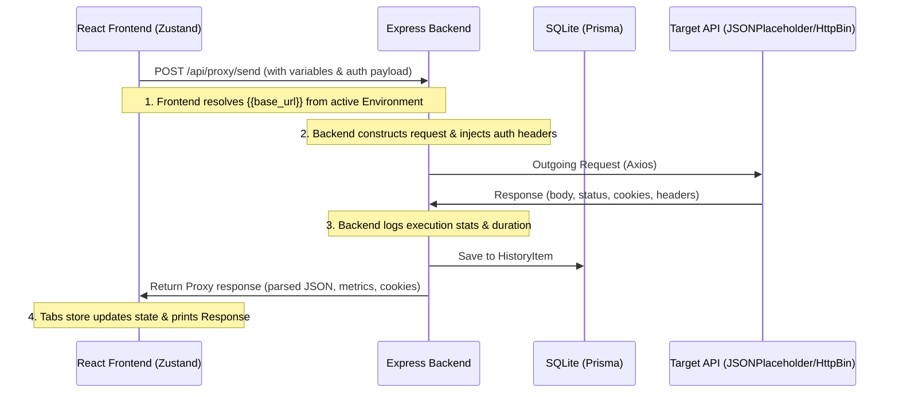

# Walkthrough - RequestLab MVP

We have built **RequestLab**, a fully functional developer-focused API client. The application is fast, features a modern glassmorphic look, and runs fully locally.

## Features Implemented

1. **Proxy Executor (`/api/proxy/send`)**:
   - Forwards client requests from the Node backend to any server to completely bypass CORS limitations.
   - Measures latency (duration) in milliseconds and calculates exact response body size in bytes.
   - Saves all execution requests to the request history.

2. **Collections & Folder Management**:
   - Supports creating, renaming, and deleting collections.
   - Support for nesting folder structures.
   - HTML5 Native Drag-and-Drop ordering saves ordering priority directly to the DB.
   - Support for bookmarking collections as Favorites.

3. **Workspace Request Editor**:
   - Support for Method Selector (GET, POST, PUT, DELETE, PATCH, etc.).
   - Support for environment variable substitutions (`{{url}}`).
   - Visual key-value-enabled table editors for Query Parameters, Custom Headers, and Cookies.
   - Authorization types: Bearer Token, Basic Auth, and API Key (places values in headers or query params).
   - Rich Monaco Editor integration for JSON, Raw text, and XML request payloads.

4. **Response Panel Viewer**:
   - Displays exact status codes (green for 2xx, orange/red for 4xx/5xx), size, and duration.
   - Tabs:
     - **Response Body**: collaspsible read-only Monaco Editor (pretty format), raw string, and sandboxed browser preview (HTML iframe render).
     - **Headers**: Table of returned response headers.
     - **Cookies**: List of returned cookies.
     - **Code Snippet Generator**: Instantly generate cURL, Fetch, Axios, or Python requests code.

5. **Settings & Global Configs**:
   - Theme configuration (Light, Dark, and System).
   - Monaco editor font-size controls.
   - Autosave toggle (auto-saves request tab changes back to collections).
   - Command Palette: press `Ctrl+Shift+P` to switch themes, clear history, create tabs, or jump to saved requests.

---

## How the Application Works Under the Hood

Here is how the architecture processes actions behind the scenes:



1. **CORS Bypass (Proxying)**: Browsers block direct HTTP requests to other domains due to Same-Origin Policy. RequestLab bypasses this by routing all client-side API requests through our local Express server `/api/proxy/send`. The server acts as a backend HTTP client, performs the call, and sends back the response data.
2. **Variable Interpolation**: When you define a placeholder like `{{token}}`, the client scans the active selected environment (and global scope fallback), replaces all double-curly indicators with their matches, and sends the resolved values to the proxy server.
3. **Reactive Autosaving**: If "Auto Save" is enabled, any key stroke or toggle inside request tabs updates the Zustand store, which schedules an update in the database via Prisma. This keeps collections synchronized in real-time.

---

## E2E Feature Testing Guide

Follow these step-by-step instructions to verify that every component is working correctly:

### Step 1: Manage Environments & Variables
1. Click the **sliders icon** in the Sidebar next to the Environment selector to open the **Environments Modal**.
2. Click **Add** in the bottom left, name the environment `Production`, and select it.
3. Under variables table, add a new row:
   - **Variable**: `base_url`
   - **Value**: `https://httpbin.org`
4. Close the modal, and select `Production` in the sidebar selector.

### Step 2: Create a Collection and Request
1. Click **New Collection** from the dashboard. Name it `HttpBin Tests`.
2. Hover over `HttpBin Tests` in the sidebar and click the **+ (Plus)** button to add a request.
3. Name the request `POST Request Test`.
4. Click the request in the sidebar to open it as a tab.

### Step 3: Build & Send the Request
1. Change the Method selector from `GET` to `POST`.
2. Set the URL to: `{{base_url}}/post` (testing environment variable interpolation).
3. Select the **Headers** tab, and add a row:
   - **Key**: `Content-Type`
   - **Value**: `application/json`
4. Select the **Body** tab, change the format to **JSON**, and write inside the Monaco Editor:
   ```json
   {
     "message": "Hello from RequestLab MVP!"
   }
   ```
5. Click **Send**!
6. Verify that the response returns `200 OK` in green, showing duration (e.g. `250 ms`) and size. The response body tab will show the returned pretty-printed JSON structure.

### Step 4: Verify the HTML Preview
1. Change request method to `GET` and set the URL to: `https://httpbin.org/html`.
2. Click **Send**.
3. Go to the response body, and click the **Preview** button.
4. Verify that it renders the HTML page visually inside the sandboxed iframe.

### Step 5: Test the Code Generator
1. Switch the response tab to **Code Snippet**.
2. Select **Python Requests** or **Axios Client** in the dropdown.
3. Verify the generated code matches your request parameters, and click **Copy** to verify clipboard copy operations.

### Step 6: Test Import / Export
1. Hover over the `HttpBin Tests` collection in the sidebar, and click the **Copy/Pages icon (Export)**. A file named `HttpBin Tests.json` will download.
2. Delete the collection by clicking the **Trash** icon.
3. Click the **Import** button at the top of the collections list, and upload the `HttpBin Tests.json` file.
4. Verify that the collection and all configured request parameters load back successfully!

### Step 7: Command Palette
1. Press `Ctrl+Shift+P` on your keyboard (or `Cmd+Shift+P`).
2. Type `Theme` and select `Switch to Light Theme`. Verify that the UI switches instantly to light mode.
3. Toggle it back to dark mode using the palette.
